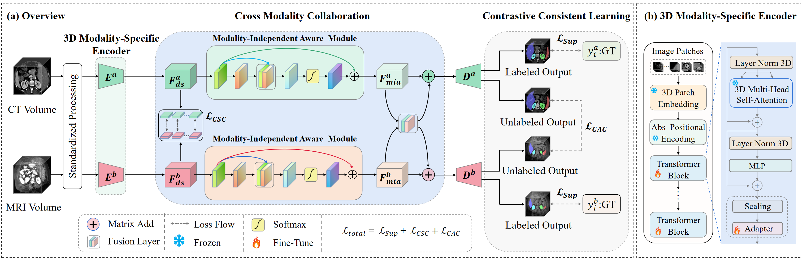

# Weakly-supervised Medical Image Segmentation with Gaze Annotations
This is the PyTorch implementation of our MICCAI 2024 paper ["Robust Semi-Supervised Multimodal Medical Image Segmentation via Cross Modality CollaborationRobust Semi-Supervised Multimodal Medical Image Segmentation via Cross Modality Collaboration"]() by Xiaogen Zhon, Yiyou Sun, Min Deng,
Winnie Chiu Wing Chu and [Qi Dou\*](https://www.cse.cuhk.edu.hk/~qdou/).

\* denotes corresponding authors.

## Abstract

> Multimodal learning leverages complementary information
derived from different modalities, thereby enhancing performance in med
ical image segmentation. However, prevailing multimodal learning meth
ods heavily rely on extensive well-annotated data from various modal
ities to achieve accurate segmentation performance. This dependence
often poses a challenge in clinical settings due to limited availability
of such data. Moreover, the inherent anatomical misalignment between
different imaging modalities further complicates the endeavor to en
hance segmentation performance. To address this problem, we propose
a novel semi-supervised multimodal segmentation framework that is ro
bust to scarce labeled data and misaligned modalities. Our framework
employs a novel cross modality collaboration strategy to distill modality
independent knowledge, which is inherently associated with each modal
ity, and integrates this information into a unified fusion layer for fea
ture amalgamation. With a channel-wise semantic consistency loss, our
framework ensures alignment of modality-independent information from
a feature-wise perspective across modalities, thereby fortifying it against
misalignments in multimodal scenarios. Furthermore, our framework ef
fectively integrates contrastive consistent learning to regulate anatomi
cal structures, facilitating anatomical-wise prediction alignment on unla
beled data in semi-supervised segmentation tasks. Our method achieves
competitive performance compared to other multimodal methods across
three tasks: cardiac, abdominal multi-organ, and thyroid-associated or
bitopathy segmentations. It also demonstrates outstanding robustness in
scenarios involving scarce labeled data and misaligned modalities.



## Highlights

- Public gaze dataset **GazeMedSeg** for segmentation as extension for the [Kvasir-SEG](https://datasets.simula.no/kvasir-seg/) and [NCI-ISBI](https://www.cancerimagingarchive.net/analysis-result/isbi-mr-prostate-2013/) datasets.
- A general plug-in framework for weakly-supervised medical image segmentation using gaze annotations.

## Gaze Dataset

Please refer to [here](/GazeMedSeg) for detailed description of our GazeMedSeg dataset.

## Getting Started

#### Installation

1. Download from GitHub

   ```bash
   git clone https://github.com/med-air/GazeSup.git
   cd GazeSup
   ```

2. Create conda environment

   ```bash
   conda env create -f environment.yaml
   conda activate gaze
   ```

#### Preparing Datasets

>Note: You can download our preprocessed dataset [here](https://drive.google.com/drive/folders/1XjgQ27R8zT8ymOTXohgl8HXntPEUbIXj?usp=sharing), allowing you to skip this and the next step to reproduce our experiments.

- Download the [Kvasir-SEG](https://datasets.simula.no/kvasir-seg/) and [NCI-ISBI](https://www.cancerimagingarchive.net/analysis-result/isbi-mr-prostate-2013/) datasets from their official websites. For NCI-ISBI, please download the Training and Test sets.
- Preprocess the datasets. We only preprocess the NCI-ISBI dataset, extracting axial slices where the prostate is present. The relevant script is [here](/notebooks/preprocess/process_nci-isbi.ipynb).

#### Preparing Gaze Annotation

- Download the GazeMedSeg [here](https://drive.google.com/drive/folders/1-38bG_81OsGVCb_trI00GSqfB_shCUQG?usp=sharing), and put the files under the [`/GazeMedSeg`](/GazeMedSeg) folder.
- Generate gaze heatmaps and refined CRF maps using the scripts [here](notebooks/gaze_annotation). These scripts will create a `gaze` folder within the original dataset directory and generate gaze heatmaps and CRF maps there. The CRF maps will serve as pseudo-masks for gaze supervision.

#### Running Experiments

```bash
python run.py -m [supervision_mode] --data [dataset] --model [backbone] -bs [batch_size] \
    --exp_path [experiment_path] --root [dataset_path] --spatial_size [image_size] \
    --in_channels [image_channels] --opt [optimizer] --lr [base_lr] --max_ite [max_ite] \
    --num_levels [num_levels] --cons_mode [cons_mode] --cons_weight [cons_weight]
```

We provide the scripts of reproducing our experiments on the Kvasir-SEG and NCI-ISBI datasets with our gaze annotation [here](./scripts). For more details on the arguments, please refer to [parse_args.py](./parse_args.py). 

#### Checkpoints

We also provide the model checkpoints for the experiments as listed below (Dice is the evaluation metric).

|           |                      Kvasir-SEG (Polyp)                      |                     NCI-ISBI (Prostate)                      |
| :-------: | :----------------------------------------------------------: | :----------------------------------------------------------: |
| Our paper |                            77.80                             |                            77.64                             |
| Released  | 78.86<br />[[script]](./scripts/gazesup_kvasir_2_levels.sh) [[checkpoint]](https://drive.google.com/file/d/1e-P7TEOIDJ04edFy1Eix8bTl5ZRD3l-g/view?usp=sharing) | 79.20<br />[[script]](./scripts/gazesup_prostate_2_levels.sh) [[checkpoint]](https://drive.google.com/file/d/1wq60hlEPFhotwPM5tCxcFK-hjPBZ842L/view?usp=sharing) |

## Contact

If you have any questions, please feel free to leave issues here, or contact [Yuan Zhong](mailto:yuanzhong@link.cuhk.edu.hk).

## Citation

``` -->
Coming soon
